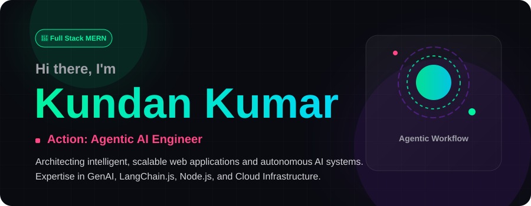

  

  

 

  
  
  

---

### 🚀 Featured Builds

| Project | What it is | Tech Stack | Stars |
| :--- | :--- | :--- | :---: |
| [**Fruitcart AI Platform**](https://github.com/KundanKumar-Tech/fruitcart) | Enterprise analytics with custom nutrition RAG assistant | `MERN`, `Vite`, `Ollama` | ⭐ |
| [**Autonomous Agent Engine**](https://github.com/KundanKumar-Tech) | Multi-agent LangChain.js microservice architecture | `Node`, `Redis`, `GenAI` | ⭐ |

---

### 🏙️ My Contribution City

  <picture>
    <source media="(prefers-color-scheme: dark)" srcset="https://raw.githubusercontent.com/KundanKumar-Tech/KundanKumar-Tech/output/github-contribution-grid-snake-dark.svg">
    <source media="(prefers-color-scheme: light)" srcset="https://raw.githubusercontent.com/KundanKumar-Tech/KundanKumar-Tech/output/github-contribution-grid-snake.svg">
    
  </picture>

  
  

  

